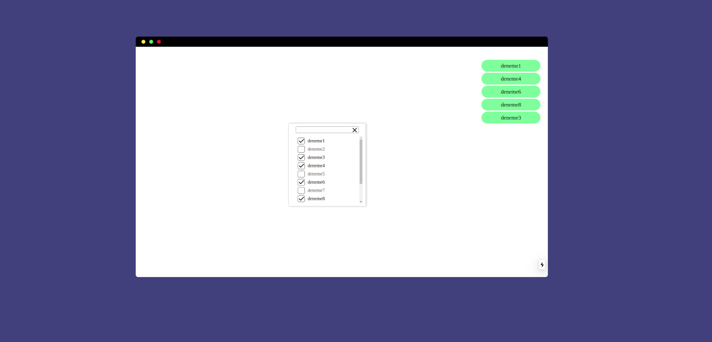

[![MIT License][license-shield]][license-url]

 <!--  -->

  <h1 align="center">checkbox list</h1>

  <p align="center">
<p>
    <br /> 
</p>




## Development

```sh
yarn
yarn dev
```

## Licence

`MIT LICENSE`

[license-shield]: https://img.shields.io/github/license/othneildrew/Best-README-Template.svg?style=flat-square
[license-url]: https://github.com/muhammeddeniz/react-starterkit/master/LICENSE.txt
